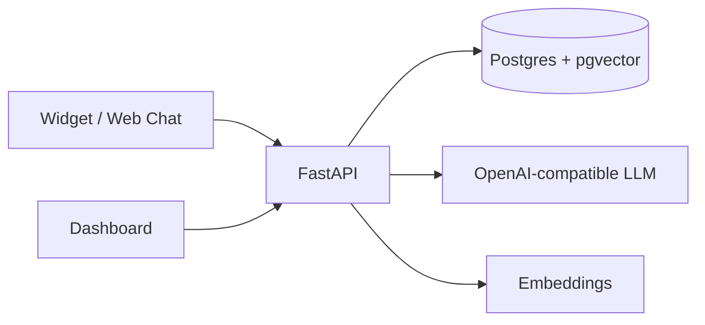

<div align="center">

# 🧠 ClientBrain — Sellable RAG Chatbot SaaS

**Chat with your website, docs & WhatsApp. White-label AI support you can resell to any business.**

[](https://github.com/kamalesh404/ClientBrain/actions/workflows/ci.yml)
[](LICENSE)
[](apps/web)
[](apps/api)
[](docker-compose.yml)

</div>

> Built for **freelance / indie**: one codebase, deploy per client, charge setup + monthly.

## ✨ What it does

- Ingest PDF / URL / sitemap / text → chunk → embed → pgvector
- Chat with citations (`[source: pricing.pdf p.2]`), never hallucinates links
- Embeddable widget: `<script src=".../widget.js" data-key="cb_xxx">` (like Intercom)
- Multi-tenant: workspaces + API keys + usage limits + lead capture
- Billing-ready: Razorpay + Stripe hooks, per-message metering

## 🏗️ Architecture



## 📂 Structure

```text
ClientBrain/
├── apps/api/      # FastAPI: ingest, retrieve, chat, billing, tenants
├── apps/web/      # Next.js 14: landing + dashboard + chat UI
├── packages/widget/ # Embeddable <script> chat bubble
├── docker-compose.yml # db (pgvector) + api + web, one command
└── .github/workflows/ci.yml
```

## ⚡ Quickstart

```bash
cp .env.example .env
# add OPENAI_API_KEY=sk-... (or use Ollama locally)
docker compose up --build
# web → http://localhost:3000
# api docs → http://localhost:8000/docs
```

Without Docker:

```bash
# API
cd apps/api && pip install -r requirements.txt && uvicorn main:app --reload
# Web
cd apps/web && npm install && npm run dev
```

## 🔌 API

| Method | Route | Purpose |
| --- | --- | --- |
| POST | `/v1/ingest/url` | ingest single URL |
| POST | `/v1/ingest/text` | ingest raw text |
| POST | `/v1/chat` | RAG chat with citations |
| GET | `/v1/health` | health check |
| GET | `/v1/stats` | usage metering (for billing) |

Chat example:

```bash
curl -X POST localhost:8000/v1/chat -H "Content-Type: application/json" \
  -d '{"workspace":"demo","message":"What are your timings?","top_k":4}'
```

## 💰 Freelance model

- Setup: ₹25k / $300 per client (ingest site + branding + deploy)
- Monthly: ₹2k / $29 (hosting + 5k messages + support)
- Upsell: WhatsApp connector, lead-CRM export, analytics

## 🗺️ Roadmap

- [x] Phase 1: multi-tenant RAG core + widget + docker + CI
- [ ] Phase 2: auth (NextAuth), Razorpay/Stripe, admin analytics
- [ ] Phase 3: WhatsApp + voice + Hugo/Jekyll site importer

## 👨‍💻 Author

[**kamalesh404**](https://github.com/kamalesh404) — CS student | AI dev | Game dev
