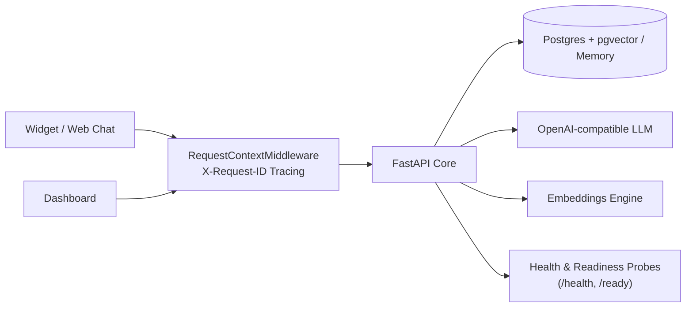

<div align="center">

# 🧠 ClientBrain — Sellable RAG Chatbot SaaS

**Chat with your website, docs & WhatsApp. White-label AI support you can resell to any business.**

[](https://github.com/kamalesh404/ClientBrain/actions/workflows/ci.yml)
[](LICENSE)
[](apps/web)
[](apps/api)
[](docker-compose.yml)

</div>

> Built for **freelance / indie**: one codebase, deploy per client, charge setup + monthly.

## ✨ What it does

- Ingest PDF / URL / sitemap / text → chunk → embed → pgvector
- Chat with citations (`[source: pricing.pdf p.2]`), never hallucinates links
- Embeddable widget: `<script src=".../widget.js" data-key="cb_xxx">` (like Intercom)
- Multi-tenant: workspaces + API keys + usage limits + lead capture
- Billing-ready: Razorpay + Stripe hooks, per-message metering

## 🏗️ Architecture


```mermaid
flowchart LR
    W[Widget / Web Chat] --> M[RequestContextMiddleware<br/>X-Request-ID Tracing]
    D[Dashboard] --> M
    M --> API[FastAPI Core]
    API --> DB[(Postgres + pgvector / Memory)]
    API --> LLM[OpenAI-compatible LLM]
    API --> EMB[Embeddings Engine]
    API --> H["Health & Readiness Probes<br/>(/health, /ready)"]
```

## 📂 Structure

```text
ClientBrain/
├── apps/api/              # FastAPI: ingest, retrieve, chat, billing, tenants
│   ├── app/
│   │   ├── routes/        # system, ingest, chat, billing, admin
│   │   ├── middleware.py  # X-Request-ID tracing & error envelopes
│   │   ├── config.py      # Pydantic Settings
│   │   ├── db.py          # PostgreSQL/pgvector + in-memory store & health check
│   │   └── ...
│   └── test_api.py        # Automated pytest test suite
├── apps/web/              # Next.js 14: landing + dashboard + chat UI
├── packages/widget/       # Embeddable <script> chat bubble
├── docker-compose.yml     # db (pgvector) + api + web, one command
└── .github/workflows/ci.yml
```

## ⚡ Quickstart

```bash
cp .env.example .env
# add OPENAI_API_KEY=sk-... (or use Ollama locally)
docker compose up --build
# web → http://localhost:3000
# api docs → http://localhost:8000/docs
```

Without Docker:

```bash
# API
cd apps/api && pip install -r requirements.txt && uvicorn main:app --reload
# Web
cd apps/web && npm install && npm run dev
```

## 🔌 API Reference & Observability

### Endpoints

| Method | Route | Purpose |
| --- | --- | --- |
| GET | `/health`, `/v1/health` | **Liveness Probe**: status, uptime, service version, backend mode |
| GET | `/ready`, `/v1/ready` | **Readiness Probe**: live database ping, latency ms, config validation |
| GET | `/` | Root API metadata & service discovery |
| POST | `/v1/ingest/url` | Ingest URL (X-API-Key, quota-checked) |
| POST | `/v1/ingest/text` | Ingest text (X-API-Key, quota-checked) |
| POST | `/v1/chat` | RAG chat, 402 when quota hit |
| GET | `/v1/stats?workspace=x` | Usage + quota + remaining tokens & messages |
| GET | `/v1/billing/plans` | Plan catalog (free/pro/scale) |
| POST | `/v1/billing/razorpay/order` | Create order (MOCK without keys) |
| POST | `/v1/billing/stripe/session` | Create session (MOCK without keys) |
| POST | `/v1/billing/upgrade` | Activate plan (demo/admin) |
| POST | `/v1/admin/keys` | Create API key (master key only) |
| GET | `/v1/admin/workspaces` | Workspace tenant diagnostics (master key only) |

### Request Tracing & Middleware

Every request passing through ClientBrain is traced using `RequestContextMiddleware`:
- **`X-Request-ID`**: Client-provided header is preserved; if omitted, a unique `req_<uuid>` is generated.
- **`X-Response-Time`**: Automatically computed request processing latency header (e.g. `4.2ms`).

### Standardized Error Envelopes

API errors return standardized error responses while maintaining backwards compatibility with legacy `detail` fields:

```json
{
  "ok": false,
  "error": {
    "code": "NOT_FOUND",
    "message": "Not Found",
    "request_id": "req_8a3f9e...",
    "timestamp": "2026-10-07T15:45:00.000000Z"
  },
  "detail": "Not Found",
  "request_id": "req_8a3f9e..."
}
```

Validation errors (`422 Unprocessable Entity`) include field-level diagnostics in `error.details`:

```json
{
  "ok": false,
  "error": {
    "code": "VALIDATION_ERROR",
    "message": "Request validation failed",
    "details": [
      { "type": "missing", "loc": ["body", "message"], "msg": "Field required" }
    ],
    "request_id": "req_...",
    "timestamp": "..."
  },
  "detail": [...],
  "request_id": "req_..."
}
```

### Health & Readiness Sample Output

`/ready` returns status 200 with dependency health diagnostics:

```json
{
  "status": "ready",
  "ready": true,
  "service": "clientbrain-api",
  "version": "0.2.0",
  "timestamp": "2026-10-07T15:45:00.000000Z",
  "checks": {
    "database": {
      "status": "ready",
      "backend": "memory",
      "responsive": true,
      "latency_ms": 0.12
    },
    "config": {
      "status": "ok",
      "chat_model": "gpt-4o-mini",
      "embed_model": "text-embedding-3-small",
      "workspace_default": "demo",
      "billing_enabled": false
    }
  }
}
```

## 🧪 Testing Guidelines

Run the automated test suite locally:

```bash
# Run all tests with verbose output
python -m pytest apps/api/test_api.py -v

# Run specific test suites
python -m pytest apps/api/test_api.py -k "health or readiness" -v
python -m pytest apps/api/test_api.py -k "error or middleware" -v
```

The automated test suite verifies:
- End-to-end RAG ingestion, chunking, vector scoring, and chat responses
- Health check (`/health`, `/v1/health`) and readiness probes (`/ready`, `/v1/ready`)
- `X-Request-ID` generation, propagation, and `X-Response-Time` latency headers
- Standardized error envelope schema across 401, 402, 403, 404, and 422 HTTP responses
- Master-key authentication enforcement and per-plan quota limits

## 💰 Freelance model

- Setup: ₹25k / $300 per client (ingest site + branding + deploy)
- Monthly: ₹2k / $29 (hosting + 5k messages + support)
- Upsell: WhatsApp connector, lead-CRM export, analytics

## 🗺️ Roadmap

- [x] Phase 1: multi-tenant RAG core + widget + docker + CI
- [x] Phase 2: API-key auth, quotas/metering, Razorpay/Stripe (mock+live), pgvector-ready, dashboard + DEPLOY.md
- [ ] Phase 3: WhatsApp + voice + site importer + NextAuth login

## 👨‍💻 Author

[**kamalesh404**](https://github.com/kamalesh404) — CS student | AI dev | Game dev
